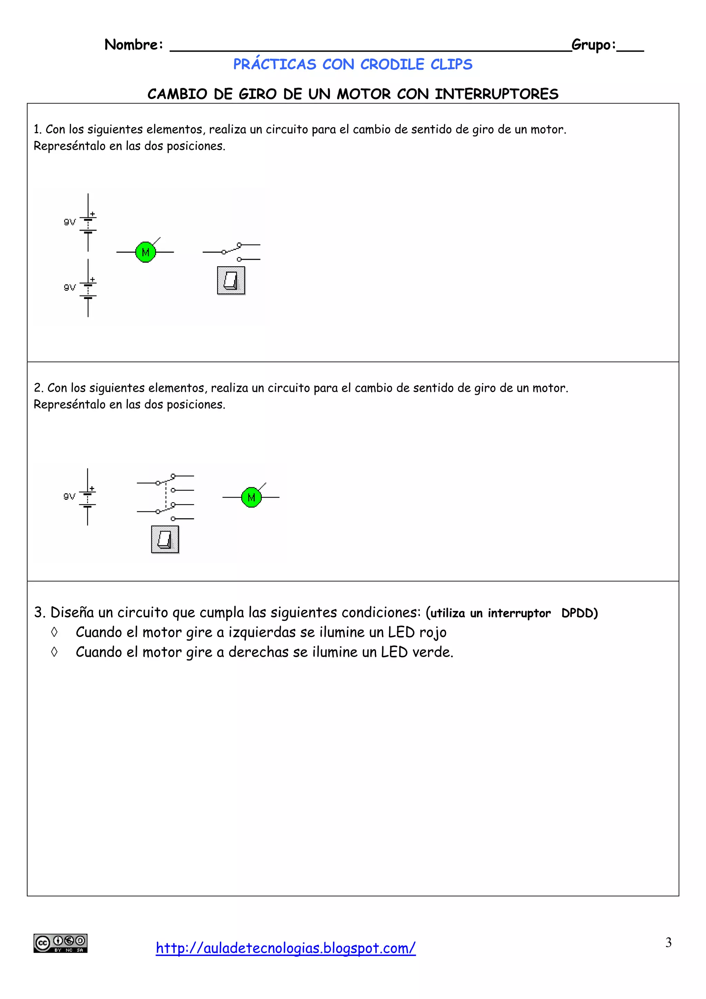
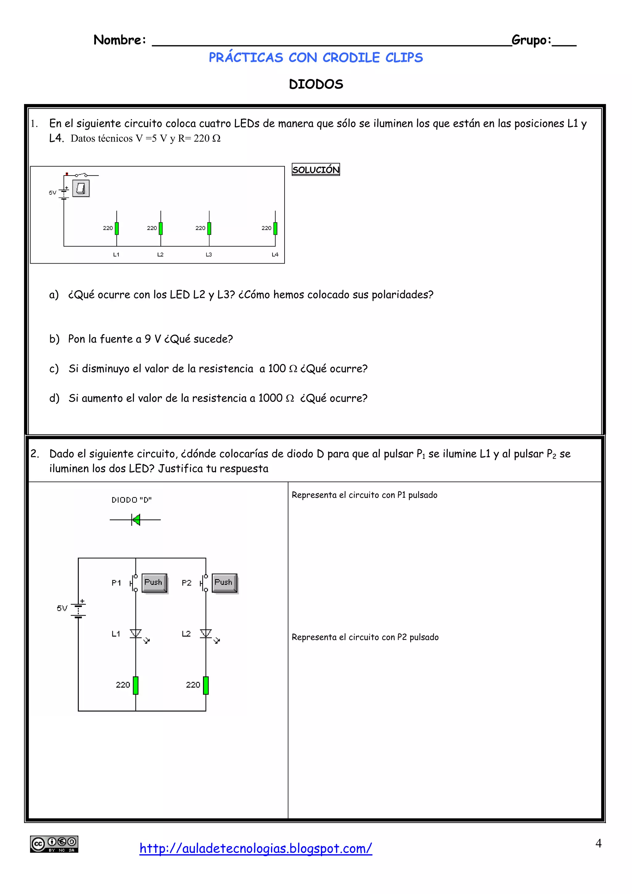
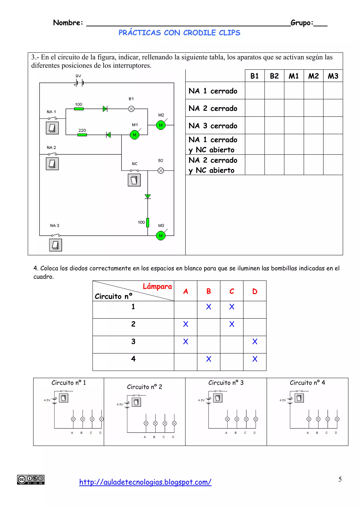

## 1. Tareas y Evaluaciones

En esta sección se listan las tareas obligatorias, sus especificaciones y las fechas límite de entrega.

| # | Tarea | Descripción breve | Fecha de Entrega | Enlace | Estado |
|---|-------|-------------------|------------------|------------------|--------|
| 01 | **Documento de prácticas** | Instalación de herramientas, clonación del repositorio y primer script de prueba. | Por determinar | [Ver documento](https://docs.google.com/document/d/1tkH4B16WcM7LHAHljhtdHFlG2upmF1rJQPBtXRdylEg/edit?usp=sharing) | 🟡 En curso |
| 02 | **Ejercicios Crocodile Clips** | Resolución de problemas en crocodile clips para subir las capturas en el ejercicio 4 del documento de prácticas | La misma que el documento de prácticas | Mirar ejercicios abajo | 🟡 En curso  |

> 💡 **Nota sobre entregas:**
> - Las entregas fuera de plazo tendrán una penalización del 10% por día de retraso.
> - Formato obligatorio de entrega: `Apellido_Nombre_TareaX.zip` o PDF según se indique en la guía.
> - Adjuntar documento en la tarea del classroom en la fecha prevista.

## 2. Ejercicios Prácticos y Guías

### Ejercicios de circuitos en crocodile clips

Hay que sacar capturas de los circuitos resueltos, así como generar las tablas en caso de que las pidan.

* 📄 

* 📄 

* 📄 

## 📂 3. Documentos y Recursos Descargables

### 📖 Temas de Clase

* 📄 

### 📖 Diapositivas y ejercicios

* 📄 

